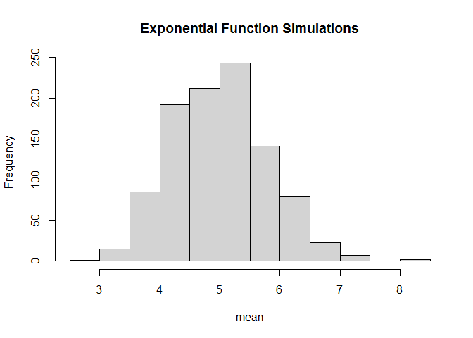
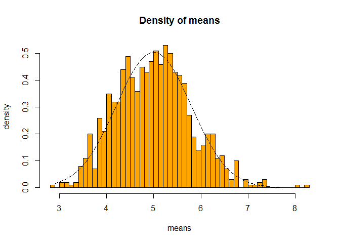
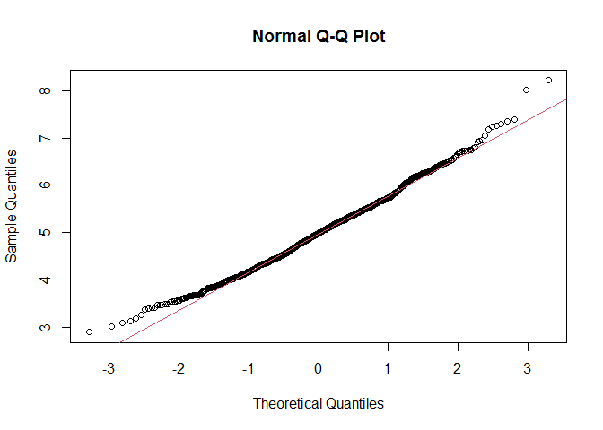

---

## Instructions

1. Show the sample mean and compare it to the theoretical mean of the distribution.
2. Show how variable the sample is (via variance) and compare it to the theoretical variance of the distribution.
3. Show that the distribution is approximately normal.

## Loading Libraries


```r
library("data.table")
library("ggplot2")
```

## Task


```r
# setting seed for reproducability
set.seed(31)
# setting lambda to 0.2
lambda <- 0.2
# 40 sample counts
n <- 40
# 1000 simulation counts
simulations <- 1000
# simulation
simulated_exponentials <- replicate(simulations, rexp(n, lambda))
# calculate the mean of the exponenttials
means_exponentials <- apply(simulated_exponentials, 2, mean)
```

## Question 1
Show the sample mean and compare it to the theoretical mean of the distribution.


```r
# get data
analytical_mean <- mean(means_exponentials)
analytical_mean
```

```
## [1] 4.993867
```


```r
# analytical mean
theory_mean <- 1/lambda
theory_mean
```

```
## [1] 5
```


```r
# data visualization
hist(means_exponentials, xlab = "mean", main = "Exponential Function Simulations")
abline(v = analytical_mean, col = "red")
abline(v = theory_mean, col = "orange")
```

<!-- -->

The analytical mean is 4.993867 and the theoretical mean is 5. Thus, the center of distribution of averages of 40 exponentials is close to the theoretical center of the distribution.

## Question 2

Show how variable the sample is (via variance) and compare it to the theoretical variance of the distribution.


```r
# standard deviation of the distribution
standard_deviation_dist <- sd(means_exponentials)
standard_deviation_dist
```

```
## [1] 0.7931608
```


```r
# standard deviation of the analytical expression
standard_deviation_theory <- (1/lambda)/sqrt(n)
standard_deviation_theory
```

```
## [1] 0.7905694
```


```r
# variance of the distribution
variance_dist <- standard_deviation_dist^2
variance_dist
```

```
## [1] 0.6291041
```


```r
# variance from the analytical expression
variance_theory <- ((1/lambda)*(1/sqrt(n)))^2
variance_theory
```

```
## [1] 0.625
```

The standard deviation of the distribution is 0.7931608 with a theoretical standard deviation calculated as 0.7905694. The theoretical variance is calculated as ((1 / ??) * (1/???n))<sup>2</sup> = 0.625. The actual variance of the distribution is 0.6291041.

## Question 3
Show that the distribution is approximately normal.


```r
xfit <- seq(min(means_exponentials), max(means_exponentials), length=100)
yfit <- dnorm(xfit, mean=1/lambda, sd=(1/lambda/sqrt(n)))
hist(means_exponentials,breaks=n,prob=T,col="orange",xlab = "means",main="Density of means",ylab="density")
lines(xfit, yfit, pch=22, col="black", lty=5)
```

<!-- -->


```r
# comparison of the distribution of averages of 40 exponentials to a normal distribution
qqnorm(means_exponentials)
qqline(means_exponentials, col = 2)
```

<!-- -->

Because of the central limit theorem (CLT), the distribution of averages of 40 exponentials is close to a normal distribution.
